# Label Printer Monitor

SNMP print counter collection for Zebra and Sato label printers. SQLite storage. Weekly reports.

## Setup

```bash
pip install -r requirements.txt          # runtime
pip install -r requirements-dev.txt      # + linting, testing, building
python main.py init
```

Edit `config/config.json`:

```json
{
  "db": { "filename": "printer_stats.db" },
  "logs": { "dir": "logs", "retention_days": 30 },
  "snmp": { "community": "public", "timeout_sec": 3, "retries": 2 },
  "collection": { "max_concurrency": 20 },
  "printers": [
    { "ip": "10.0.1.10", "model": "Sato CL4NX Plus", "location": "Linia 1" },
    { "ip": "10.0.1.11", "model": "Zebra ZT411", "location": "Linia 2" },
    { "ip": "10.0.1.12", "model": "Zebra GX430t", "location": "Linia 3" }
  ]
}
```

## Usage

```bash
python main.py                          # interactive shell: lpm > prompt
python main.py shell                    # same, as an explicit subcommand
python main.py help                     # full help: every command + its options
python main.py help report              # options for a single command
python main.py init                     # create config from the example
python main.py collect                  # collect from all printers
python main.py collect -v               # SNMP debug output
python main.py report                   # current week
python main.py report --from 2026-09-01 --to 2026-09-30
python main.py report --csv
python main.py validate                 # config + schema + DB checks
python main.py validate --network       # + ping printers over SNMP
python main.py schedule -v              # manage the Windows scheduled task
```

Running with no arguments drops you into the interactive shell, where the same
commands run at the `lpm > ` prompt (`help` lists them all, `exit` or Ctrl+D
leaves). With piped/redirected stdin, bare `lpm` prints the full help instead.

Lint: `ruff check .` / `ruff format .` / `mypy`

## Where files live

| Run mode | Config / data / logs |
| --- | --- |
| From source (`python main.py`) | next to the repo: `config/`, `data/`, `logs/` |
| Installed build (`lpm.exe`) | `%ProgramData%\com.logy.lpm\` (typically `C:\ProgramData\com.logy.lpm`) |

The installed location is machine-wide on purpose: it is the same for every
Windows account, exists without a user profile loaded, and is therefore
identical for the interactive CLI and for a headless Task Scheduler run
(as SYSTEM, pre-login, with no stored password). A per-user location such as
`%APPDATA%` would give the scheduled task a different config, database and
log tree than the one an operator edits.

Set `LPM_HOME` to relocate an installed build's data. It points at the
folder that directly contains `config/`, `data/` and `logs/`.

The install location itself (`Program Files`, `Program Files (x86)`, or a
directory you pick on the installer's directory page) does not matter: the
app asks Windows for its own running image (`src.env.exe_path()` — not
`sys.executable`, which reports a phantom `python.exe` in a frozen build),
so the scheduled task is pinned to the real `lpm.exe` wherever it ended up. Only the *data* location
has to be writable by the account running the task - the NSIS installer
creates it and grants `BUILTIN\Users` modify. For a zip distribution (no
installer), create `%ProgramData%\com.logy.lpm` and run `lpm init` as the
account that will own the scheduled task, otherwise that folder belongs
solely to whoever created it.

## Compiled binary

Build with [Nuitka](https://nuitka.net/):

```bash
build.bat                     # full pipeline: exe + installer
build.bat --exe               # build exe only -> dist/main.dist/lpm.exe
build.bat --installer         # build installer only -> installer/lpm-setup.exe
```

Zip `dist/main.dist/` for distribution. On the target machine, extract
somewhere permanent and add that directory to PATH.

**Windows PowerShell:**

```powershell
$currentPath = [Environment]::GetEnvironmentVariable("Path", "User")
[Environment]::SetEnvironmentVariable("Path", "$currentPath;C:\Tools\lpm", "User")
```

Or build an installer: `makensis installer/lpm.nsi` (ships the full `main.dist/` directory).

Usage is identical, replace `python main.py` with `lpm`:

```bash
lpm                        # interactive shell (lpm > prompt)
lpm help                   # full help: every command + its options
lpm collect
lpm report --csv
lpm validate --network
```

## Scheduling

### Linux (cron)

```
0 5 * * 1-5  lpm collect
0 15 * * 1-5 lpm collect
```

### Windows (Task Scheduler)

Preferred: `lpm schedule` (run as administrator) creates and maintains
`\LPM\LPM_Collect` from the `schedule` section of `config.json`, and pins
the absolute path of `lpm.exe` into the task so headless runs never depend
on PATH.

The task runs as the **SYSTEM** account (`S-1-5-18`, logon type
`TASK_LOGON_SERVICE_ACCOUNT`): no stored password, runs whether or not any
user is logged on, and keeps network access - a passwordless S4U logon gets
no network or encrypted-file access, and interactive logon types only run
while somebody is logged in. `lpm schedule` re-registers any task whose
principal is not SYSTEM, and `lpm validate` flags the drift.

Registering manually instead - read the install location from the registry key
the installer writes, so a custom install directory (or a 32-bit build under
`Program Files (x86)`) is handled without editing the script:

```powershell
$exe = Join-Path (Get-ItemProperty 'HKLM:\Software\lpm').InstallDir 'lpm.exe'
$action = New-ScheduledTaskAction -Execute $exe -Argument "collect" -WorkingDirectory (Split-Path $exe)
$trigger1 = New-ScheduledTaskTrigger -Daily -At "05:00"
$trigger2 = New-ScheduledTaskTrigger -Daily -At "15:00"
$settings = New-ScheduledTaskSettingsSet -ExecutionTimeLimit (New-TimeSpan -Minutes 2)

Register-ScheduledTask -TaskName "PrinterStatsAM" -Action $action -Trigger $trigger1 -Settings $settings
Register-ScheduledTask -TaskName "PrinterStatsPM" -Action $action -Trigger $trigger2 -Settings $settings
```

## Supported printers

All length values stored in **meters** (converted at collection time).

| Printer         | Labels | Odometer | Notes                            |
| --------------- | ------ | -------- | -------------------------------- |
| Zebra ZT411     | yes    | yes      | Link-OS ".200" odometer          |
| Zebra ZD621     | yes    | yes      | experimental (".200", unverified) |
| Zebra ZT230     | yes    | yes      | experimental (".200", unverified) |
| Zebra GX430t    | -      | yes      | SNMPv1, usage string only        |
| Sato CL4NX Plus | -      | yes      |                                  |

The ZD621 / ZT230 adapters assume Link-OS ZQL `.10642.200` objects (the
same three OIDs the ZT411 reads) but have not been verified on hardware
yet - if such a printer stays unreachable, set `snmp_version = 0` in its
adapter (pre-Link-OS firmware answers SNMPv1 only).

## Adding an adapter

Copy any file in `src/adapters/`, declare OIDs and converters:

```python
from adapters.base import PrinterAdapter, Metric


class ZebraZD621Adapter(PrinterAdapter):
    model_prefixes = ("zebra zd621",)
    snmp_version = 1
    reachability_oid = "1.3.6.1.4.1.10642.1.1.0"
    metrics = (
        Metric("labels_total", oid="1.3.6.1.4.1.10642.3.1.6.0", convert="int"),
        Metric("meters_total", oid="1.3.6.1.4.1.10642.3.1.1.0", convert="float", unit="cm"),
    )
```

Register in `src/adapters/__init__.py` and add the model to `config/config.json.schema`.

## Database

`snapshots` table:

| Column       | Type    | Description            |
| ------------ | ------- | ---------------------- |
| printer_ip   | TEXT    | Printer IP             |
| timestamp    | INTEGER | Unix epoch             |
| labels_total | INTEGER | Labels printed         |
| meters_total | FLOAT   | Media length in meters |
| model_name   | TEXT    | Printer model          |

## Project structure

```
main.py                 # entry point
config/
  config.json           # printer list + SNMP settings (gitignored)
  config.example.json   # starter config
  config.json.schema    # JSON Schema
data/
  printer_stats.db      # SQLite database (gitignored)
  backups/              # auto-backup before each run (gitignored)
logs/                   # per-run log files, pruned after logs.retention_days (gitignored)
src/
  adapters/             # printer adapters (declarative SNMP specs)
  converters.py         # unit conversion (cm/in/ft/mm -> meters)
  db.py                 # SQLite storage
  report.py             # weekly report generator
  shell.py              # interactive `lpm >` shell (REPL)
  snmp_client.py        # pysnmp wrapper
  validate.py           # setup validation
build.py                # Nuitka build script
tools/
  snmpget.py            # single OID query (standalone)
  snmpwalk.py           # OID subtree walker (standalone)
  linkos_walk.py        # walks all known Link-OS / ZEBRA-MIB OIDs (ranges, JSON/CSV)
```

## Architecture

```mermaid
flowchart TD

subgraph group_orchestration["CLI Orchestration"]
  node_cli["Command CLI<br/>[main.py]"]
  node_config["Runtime Config"]
  node_backup[("Database Backup<br/>[main.py]")]
end

subgraph group_collection["Collection Engine"]
  node_registry["Adapter Registry<br/>[__init__.py]"]
  node_base_engine["Adapter Engine<br/>[base.py]"]
  node_zebra_zt411["Zebra ZT411<br/>[zebra_zt411.py]"]
  node_zebra_gx430t["Zebra GX430t<br/>[zebra_gx430t.py]"]
  node_sato_cl4nx["Sato CL4NX<br/>[sato_cl4nx_plus.py]"]
  node_snmp["SNMP Client<br/>[snmp_client.py]"]
  node_converters["Unit Converters<br/>[converters.py]"]
end

subgraph group_persistence["Persistence Reporting"]
  node_sqlite[("SQLite Snapshots<br/>[db.py]")]
  node_report["Weekly Reports<br/>[report.py]"]
  node_csv["CSV Export<br/>[report.py]"]
end

subgraph group_operations["Operations Validation"]
  node_validator["Setup Validator<br/>[validate.py]"]
  node_schema["Config Schema<br/>[config.json.schema]"]
end

node_user(("Operator"))
node_printer["Label Printers"]

node_user -->|"invokes commands"| node_cli
node_cli -->|"loads config"| node_config
node_cli -->|"backs up database"| node_backup
node_cli -->|"starts collection"| node_registry
node_registry -->|"creates adapter"| node_zebra_zt411
node_registry -->|"creates adapter"| node_zebra_gx430t
node_registry -->|"creates adapter"| node_sato_cl4nx
node_zebra_zt411 -->|"extends engine"| node_base_engine
node_zebra_gx430t -->|"extends engine"| node_base_engine
node_sato_cl4nx -->|"extends engine"| node_base_engine
node_base_engine -->|"reads counters"| node_snmp
node_base_engine -->|"converts units"| node_converters
node_snmp -->|"queries SNMP"| node_printer
node_cli -->|"writes snapshots"| node_sqlite
node_cli -->|"runs report"| node_report
node_report -->|"reads history"| node_sqlite
node_report -->|"writes CSV"| node_csv
node_report -->|"prints report"| node_user
node_cli -->|"runs validation"| node_validator
node_validator -->|"checks config"| node_config
node_validator -->|"validates schema"| node_schema
node_validator -->|"checks adapters"| node_registry
node_validator -->|"checks database"| node_sqlite
node_validator -.->|"checks network"| node_snmp

click node_cli "https://github.com/logyqt/label-printer-monitor/blob/main/main.py"
click node_backup "https://github.com/logyqt/label-printer-monitor/blob/main/main.py"
click node_registry "https://github.com/logyqt/label-printer-monitor/blob/main/src/adapters/__init__.py"
click node_base_engine "https://github.com/logyqt/label-printer-monitor/blob/main/src/adapters/base.py"
click node_zebra_zt411 "https://github.com/logyqt/label-printer-monitor/blob/main/src/adapters/zebra_zt411.py"
click node_zebra_gx430t "https://github.com/logyqt/label-printer-monitor/blob/main/src/adapters/zebra_gx430t.py"
click node_sato_cl4nx "https://github.com/logyqt/label-printer-monitor/blob/main/src/adapters/sato_cl4nx_plus.py"
click node_snmp "https://github.com/logyqt/label-printer-monitor/blob/main/src/snmp_client.py"
click node_converters "https://github.com/logyqt/label-printer-monitor/blob/main/src/converters.py"
click node_sqlite "https://github.com/logyqt/label-printer-monitor/blob/main/src/db.py"
click node_report "https://github.com/logyqt/label-printer-monitor/blob/main/src/report.py"
click node_csv "https://github.com/logyqt/label-printer-monitor/blob/main/src/report.py"
click node_validator "https://github.com/logyqt/label-printer-monitor/blob/main/src/validate.py"
click node_schema "https://github.com/logyqt/label-printer-monitor/blob/main/config/config.json.schema"

classDef toneNeutral fill:#f8fafc,stroke:#334155,stroke-width:1.5px,color:#0f172a
classDef toneBlue fill:#dbeafe,stroke:#2563eb,stroke-width:1.5px,color:#172554
classDef toneAmber fill:#fef3c7,stroke:#d97706,stroke-width:1.5px,color:#78350f
classDef toneMint fill:#dcfce7,stroke:#16a34a,stroke-width:1.5px,color:#14532d
classDef toneRose fill:#ffe4e6,stroke:#e11d48,stroke-width:1.5px,color:#881337
classDef toneIndigo fill:#e0e7ff,stroke:#4f46e5,stroke-width:1.5px,color:#312e81
classDef toneTeal fill:#ccfbf1,stroke:#0f766e,stroke-width:1.5px,color:#134e4a
class node_cli,node_config,node_backup toneBlue
class node_registry,node_base_engine,node_zebra_zt411,node_zebra_gx430t,node_sato_cl4nx,node_snmp,node_converters toneAmber
class node_sqlite,node_report,node_csv toneMint
class node_validator,node_schema toneRose
class node_user,node_printer toneIndigo
```


